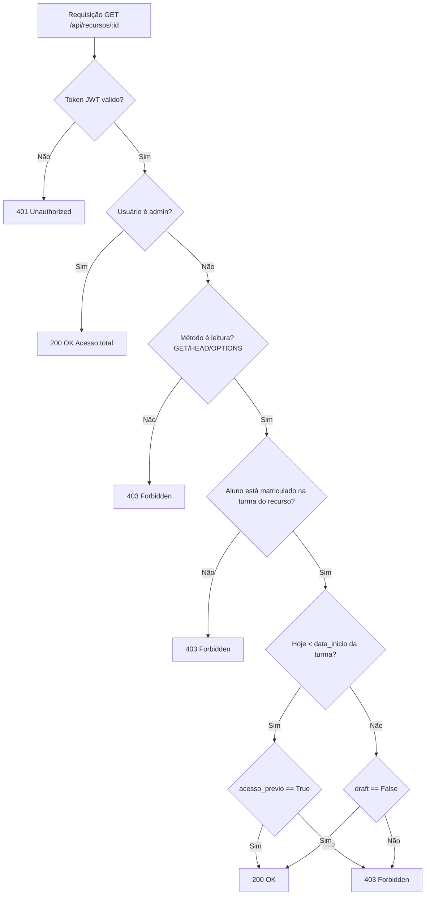

## StudyHub

Plataforma simples para gerenciamento de treinamentos, turmas e matrículas, com API em Django/DRF e app web em React + Vite.

### Arquitetura
- **API**: `apps/api` (Django 5 + DRF + JWT)
- **Web**: `apps/web` (React 19, TanStack Router/Query, Tailwind)
- **Orquestração**: `docker-compose.yml` sobe `api` (Gunicorn) e `web` (Nginx)

### Variáveis de Ambiente (docker-compose)
- `API_PORT` (padrão 8000)
- `WEB_PORT` (padrão 3000)
- `API_URL` (ex.: http://localhost:8000)
- `DJANGO_SECRET_KEY`
- `DJANGO_CORS_ALLOWED_ORIGINS` (padrão http://localhost:3000)
- `DJANGO_ALLOWED_HOSTS` (padrão *)
- `DJANGO_DEBUG` (True/False)

### Como Rodar (Docker)
```bash
git clone https://github.com/kaduh15/studyhub
cd StudyHub
API_PORT=8000 WEB_PORT=3000 API_URL=http://localhost:8000 \
DJANGO_SECRET_KEY=dev-secret docker compose up --build
```
- API: `http://localhost:8000`
- Web: `http://localhost:3000`

Crie um superusuário no container (primeira execução):
```bash
docker compose exec api uv run manage.py createsuperuser
```

Importante: no momento da criação, defina o mesmo valor para username e email.
Exemplo (interativo):
```text
Username: admin@teste.com
Email address: admin@teste.com
Password: ********
```

### Como Rodar (Local, sem Docker)
API:
```bash
cd StudyHub/apps/api
python -m venv .venv && source .venv/bin/activate
pip install uv && uv sync
export DJANGO_SECRET_KEY=dev-secret
uv run manage.py migrate
uv run manage.py runserver 0.0.0.0:8000
```
Web:
```bash
cd StudyHub/apps/web
pnpm install
VITE_APP_URL_API=http://localhost:8000 pnpm dev --port 3000
```

### Arquivos de Ambiente
- Exemplos criados:
  - Raiz: `env.example`
  - API: `apps/api/env.example`
  - Web: `apps/web/env.example`

Copie para `.env` em cada local:
```bash
cp StudyHub/env.example /home/dev/www/StudyHub/.env
cp StudyHub/apps/api/env.example /home/dev/www/StudyHub/apps/api/.env
cp StudyHub/apps/web/env.example /home/dev/www/StudyHub/apps/web/.env
```

### Autenticação (JWT)
- Obter token: `POST /api/auth/token` com `{"username","password"}`
- Usar: `Authorization: Bearer <token>`

### Principais Endpoints
- `POST /api/auth/token` — login JWT
- `GET /api/alunos/` — alunos (próprios dados para aluno, todos para admin)
- `GET /api/treinamentos/` — treinamentos
- `GET /api/turmas/` — turmas (filtradas por matrícula para aluno)
- `GET /api/recursos/` — materiais (regras de acesso por matrícula/data/flags)

### Demo (se disponível)
Pode haver uma demo pública em execução. Caso esteja online:
- Web: `[Demo](https://studyhub.lebdev.me/)` (pode estar offline)
- API: `[Demo](https://api.studyhub.lebdev.me/)` (pode estar offline)

Credenciais de teste (se ativas na demo):
- Admin: `admin@email.com / 12345678`
- Aluno: `aluno@email.com / alu@123`

Obs.: A demo pode estar fora do ar a qualquer momento.

### Status do Projeto
- Base de autenticação, turmas, matrículas e permissões implementadas
- Regras de acesso a recursos por matrícula, data e flags configuradas
- 🚧 Recurso de upload/armazenamento de materiais (vídeo, PDF, ZIP) ainda não está completo

### Fluxo (Mermaid) — Acesso a Recursos


### Documentação Detalhada
- API: `apps/api/API_DOCUMENTATION.md`
- Banco de Dados: `apps/api/DATABASE_DOCUMENTATION.md`
- Permissões: `apps/api/PERMISSIONS_DOCUMENTATION.md`

### Tecnologias
- Django, DRF, SimpleJWT, CORS Headers
- React, Vite, TanStack Router/Query, Tailwind, Nginx
- Docker, Gunicorn

### Licença
Projeto educacional — StudyHub


